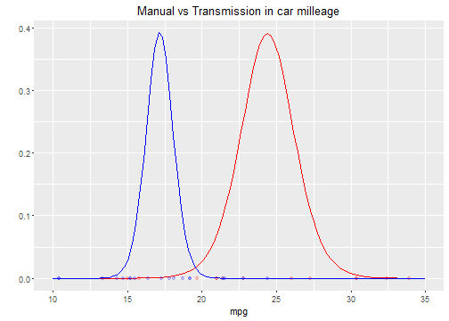
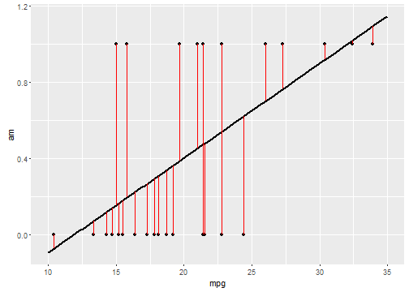
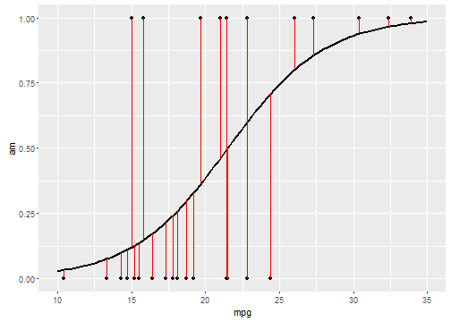

## Summary

1. t test analysis
2. Linear regresion analysis
3. Logistic regrsion analysis

--- 

## T test analyisis

The *p value*  t test between the two populations is 0.0013736 so we can discard the hypotesis of being equal.

--- 

## Linear regresion analysis

--- 

## Logistic regresion analysis

